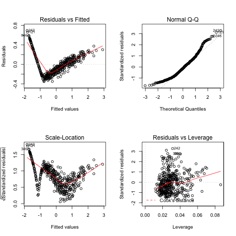
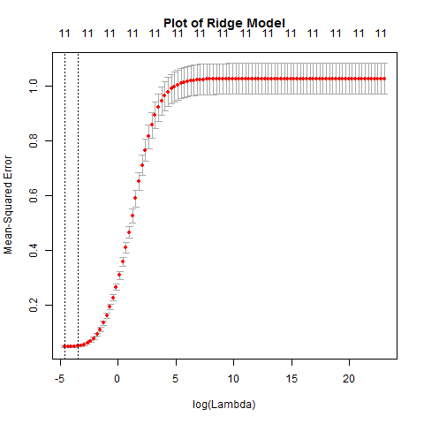
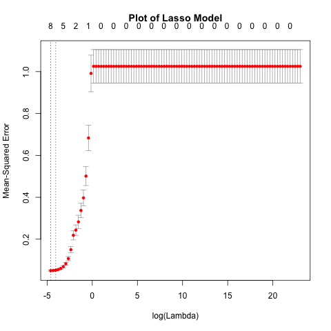
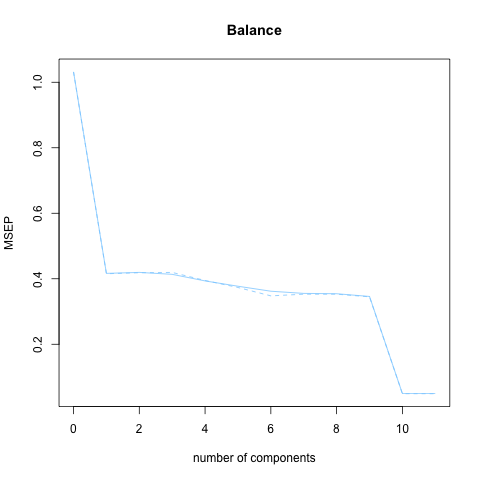
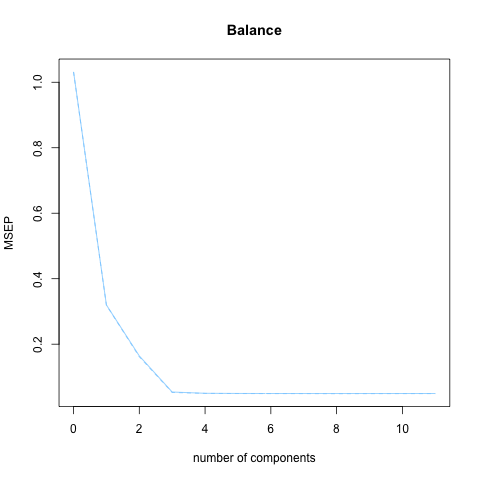

## Analysis

  In this section we will show the processes used to perform each of the five regression methods: Ordinary Least Squares, Ridge regression, LASSO, PCR, and PLS. We will also display plots for each regression.
  Each regression model was fitted on the training data and we identified the best model. Using this best model we fit it again on the testing data and calculated the MSE value. Finally, we fit the best model again on the entire dataset for comparison. Before running these regressions, we factorized categorical variables and then standardized the data. 


### OLS Regression

```{r, echo=F, echo=T}

# Fit Model

ols<-lm(Balance~Income+Limit+Rating+Cards+Age+Education
        +GenderFemale+StudentYes+MarriedYes+EthnicityAsian
        +EthnicityCaucasian, 
        data=as.data.frame(scaled_credit))

summary_ols <- summary(ols)
mse_ols <- mean(ols$residuals^2)

sink(file = "data/model-results/ols-results.txt")
summary_ols
paste("MSE")
mse_ols
sink()

save(ols, summary_ols, mse_ols, 
     file ='data/ols-saved-objects.Rdata')
```



### Ridge Regression

```{r eval = F, echo = T}

library(glmnet)
set.seed(1)

# Fit Model

ridge_mod <- cv.glmnet(x, y, intercept = FALSE, standardize = FALSE, lambda = grid, alpha = 0)

# Find best model

ridge_best_labmda <- ridge_mod$lambda.min

# Find MSE on test set

ridge_pred <- predict(ridge_mod,
                      s= ridge_best_labmda,
                      newx= model.matrix(Balance ~ ., data = data.frame(credit_test)))

ridge_mse <- mean((ridge_pred - credit_test[,12])^2)

# Refit on full dataset

ridge_fit_full <- cv.glmnet(model.matrix(Balance ~ .,data = data.frame(scaled_credit)),
                            data.frame(scaled_credit)$Balance, 
                            intercept = FALSE,
                            standardize = FALSE,
                            alpha = 0)


```



### LASSO Regression

```{r eval = F, echo = T}

library(glmnet)
set.seed(1)

# Fit Model

grid = 10^seq(10, -2, length = 100)

set.seed(1)

x <- model.matrix(Balance ~ ., data = data.frame(credit_train))
y <- data.frame(credit_train)$Balance

lasso_mod <- cv.glmnet(x, y, intercept=FALSE, standardize=FALSE, lambda = grid, alpha=1)
summary(lasso_mod)


lasso_best_mod <- lasso_mod$lambda.min

# Preditct and MSE

lasso_pred <- predict(lasso_mod, s = lasso_best_mod, newx= model.matrix(Balance ~ ., data = data.frame(credit_test)))
lasso_mse <- mean((lasso_pred - credit_test[,12])^2)

# Refit on full dataset

lasso_fit_full <- cv.glmnet(model.matrix(Balance ~ .,data = data.frame(scaled_credit)),
                            data.frame(scaled_credit)$Balance,
                            intercept = FALSE,
                            standardize = FALSE, 
                            alpha=1)


(lasso_pred_full <- predict (lasso_fit_full, type="coefficients", s = lasso_best_mod))

```



### Principal Components Regression

```{r eval = F, echo = T}

library(pls)
set.seed(1)

# Fit Model

pcr_fit=pcr(Balance ~ ., 
             data = data.frame(credit_train),
             scale = FALSE,
             validation = "CV")
summary(pcr_fit)

# Find number of components with best fit

best_mod_comp_pcr <- which.min(pcr_fit$validation$PRESS) # 10
#save(best_mod_comp_pcr, file = "data/pcr_best_model_component.RData")

# Predict and MSE

pcr_pred = predict(pcr_fit, 
                   credit_test[,-12],
                   ncomp = best_mod_comp_pcr)

pcr_mse <- mean((pcr_pred - credit_test[,12])^2)
#save(pcr_mse, file = "data/pcr_mse.RData")

# Refit on full dataset & get coefficients

pcr_fit_full <- pcr(Balance ~ .,
                     data = data.frame(scaled_credit),
                     scale = FALSE, 
                     ncomp = best_mod_comp_pcr)

pcr_full_coefs <- coefficients(pcr_fit_full)

```



### PLS Regression

```{r eval = F, echo = T}

library(pls)
set.seed(1)

# Fit Model

pls_fit=plsr(Balance ~ ., 
             data = data.frame(credit_train),
             scale = FALSE,
             validation = "CV")
summary(pls_fit)

# Find number of components with best fit

best_mod_comp_pls <- which.min(pls_fit$validation$PRESS)

# Predict and MSE

pls_pred = predict(pls_fit, 
                   credit_test[,-12],
                   ncomp = best_mod_comp_pls)


pls_mse <- mean((pls_pred - credit_test[,12])^2)

# Refit on full dataset

pls_fit_full <- plsr(Balance ~ .,
                     data = data.frame(scaled_credit),
                     scale = FALSE, 
                     ncomp = 5)

pls_full_coefs <- coefficients(pls_fit_full)

```



